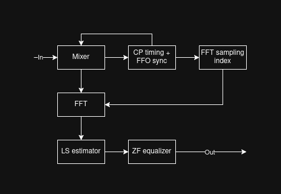

# Magic OFDM receiver
Compact OFDM receiver for educational and further development purposes. It is supposed to be a part of the *Magic* video link.

## Architecture

## Why this architecture
I exploit the fact, that the video signal is continuous and periodic, and therefore normally never interrupted. This leads to many attractive simplifications.

## TODO
- [x] Basic timing and FFO synchronization
- [x] Radix-2^2 SDF 1024-point FFT
- [x] LS estimator and linear interpolator
- [x] ZF equalizer
- [ ] Run it on an FPGA and prove it works
- [ ] Verify performance
